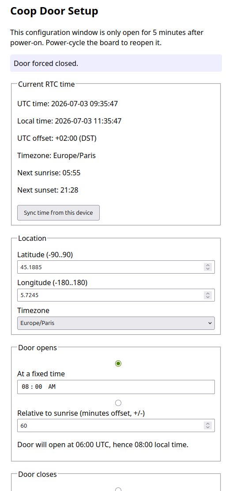

# Poulailler — automatic chicken coop door controller

ESP32-C6 + DS3231 RTC + DRV883 motor driver, battery powered, no internet
access. The door opens/closes on a schedule (fixed time or an offset from
locally-computed sunrise/sunset). Configuration happens through a WiFi
access point served for 5 minutes after every wake; the rest of the time the
ESP32 stays in deep sleep and wakes shortly before the next scheduled action.

## Wiring


| Signal | ESP32 pin | Notes |
|---|---|---|
| DS3231 SDA | GPIO19 | I2C data |
| DS3231 SCL | GPIO20 | I2C clock |
| DS3231 INT/SQW | GPIO1 | Needs a pull-up to 3.3V (most breakout boards already have one). Wakes the ESP32 from deep sleep. |
| Status LED | GPIO15 | On while the ESP32 is awake; blinks during motor movement. |
| DRV883 IN1 | GPIO22 | Direction input |
| DRV883 IN2 | GPIO23 | Direction input |
| DRV883 SLEEP | GPIO21 | Driver enable |

Pin numbers live in `include/config.h` if you need to change them. The
diagram above is generated by PinViz — see [`doc/wiring.md`](doc/wiring.md)
for its source and how to regenerate it.

Power the ESP32-C6, DS3231, and DRV883 according to their board ratings.
All grounds must be common. Add suitable bulk capacitance near the motor
driver to absorb stall-current sag and avoid browning out the ESP32 during
movement.

## Debugging the config page on your computer (no hardware needed)

`src/WebPortal.cpp` is tightly coupled to ESP32-only APIs (`WiFi.h`,
`WebServer.h`, `RTClib`), so it can't run on a desktop directly. For
iterating on the page's HTML/CSS/JS and form validation, use the
zero-dependency mock server instead:

```
python3 mock/dev_portal_mock.py       # serves http://127.0.0.1:8080/
```

It mirrors the same routes, field names, and validation ranges as the real
portal (`/`, `/save`, `/settime`, `/force-open`, `/force-close`, `/sleep`),
backed by an in-memory config that resets when you restart it. Sunrise/sunset
is computed with a pure-Python port of the same NOAA algorithm `Dusk2Dawn`
uses, so the sun-offset fields behave like the real device. It does
**not** drive GPIO or persist to NVS, and `/sleep` is a no-op acknowledgment
rather than a real deep-sleep/reboot — it's purely for iterating on the page
itself.
Its markup is loaded straight from `src/WebPortalTemplate.h` and re-read on
every request, so editing that file and reloading the browser is enough —
there's no separate copy to keep in sync.

Smoke-tested end to end (already verified): `GET /` renders the form,
`POST /save` persists valid input and rejects invalid input (e.g. an
out-of-range latitude) with a 400 instead of partially saving, and
`POST /force-open` / `/force-close` update the displayed last event.

## Building and flashing

1. Create a Python virtualenv and install PlatformIO into it (keeps it off
   your system Python and sidesteps any broken system-wide `pio` install):
   ```
   python3 -m venv .venv
   source .venv/bin/activate
   pip install platformio
   ```
2. Build the firmware:
   ```
  make build
   ```
3. Flash it, then open the serial monitor (or `make flash` to do both):
   ```
  make upload
  make monitor
   ```

## First boot / configuration



1. Power on the board. It starts a WiFi access point: **SSID `CoopDoor`**,
   password `123456789` (change it in `include/config.h` if you like).
2. Connect a phone/laptop to that AP. Most devices will auto-prompt to open
   the config page (captive portal detection); if yours doesn't, browse to
   `http://192.168.4.1/` manually.
3. Click **"Sync time from this device"** first — the DS3231 has no other
   time source, so accuracy depends entirely on your phone/laptop clock.
4. Set latitude/longitude and pick your timezone from the list — DST is
   handled automatically for the zones in `src/TimeZones.h`.
5. Choose open/close mode (fixed time, or offset from sunrise/sunset) and
   save. A fixed time is entered in local time; each fieldset shows the
   resolved open/close time in both UTC and local, since UTC is what's
   actually compared against under the hood.
6. Use **Force Open** / **Force Close** to verify the motor direction and
   confirm `motorRunMs` is long enough for a full travel (with margin — aim
   for ~15–20% more than the bare minimum, since motor speed sags as the
   battery ages).
7. The AP runs for 5 minutes after every wake, including a DS3231 alarm
  wake or the fallback timer wake. This makes the configuration page and
  manual controls available without a manual reset.

After the 5-minute window it computes the next due action, arms the DS3231
alarm for a wake shortly before it, and goes into deep sleep. The page also
re-checks the schedule every few seconds while it is open, so a schedule
saved for a few minutes from now can fire and move the door live. A trigger
debounce prevents repeated movement for the same scheduled occurrence.

## Debug tracing

Flash `make flash-debug` instead of `make flash` to get a build with serial
traces enabled (boot/wake cause, resolved open/close times, door moves,
portal activity and saves — see `include/Debug.h` and the "Debugging"
section of `CLAUDE.md` for the full list). It's the same firmware otherwise;
a plain `make build`/`make flash` never compiles any of it in.

On the config page's Debug panel, **Sleep now** ends the portal immediately
and puts the board to deep sleep, instead of waiting out the rest of the
5-minute window — useful for quickly getting to a real DS3231/`ext0` wake
to confirm the schedule fires correctly on its own, without the portal's
live schedule-check (above) doing the work instead.

## What to verify on real hardware

This project was written and built without physical hardware in the loop
(no ESP32/DS3231/BTS7960/motor available here). Confirm on your bench:

- `pio run` builds cleanly for `dfrobot_firebeetle2_esp32c6` (already verified without
  hardware — this just compiles the firmware).
- Sunrise/sunset times: `Dusk2Dawn` (added via `lib_deps`, see
  `Scheduler::computeSunTimes()`) is a well-established port of NOAA's
  solar calculator, but double-check a few open/close times computed for
  your actual lat/lon against a known-good source before relying on it.
- Motor direction: does "Force Open" actually raise the door? Swap the
  `RPWM`/`LPWM` wiring or the logic in `DoorController::open()` if reversed.
- Motor timing: does `motorRunMs` fully open/close the door without
  over-running into the mechanical stop for an extended period (which
  wastes battery and stresses the mechanism)?
- Deep sleep + wake: after saving a schedule, does the board actually wake
  at the scheduled time and not before? Measure sleep current with a
  multimeter/USB power meter to sanity-check battery life expectations.
- DS3231 alarm interrupt wiring: confirm `INT/SQW` genuinely pulls the
  ESP32 out of deep sleep (GPIO15, `ext0`, wake-on-LOW) — a missing pull-up
  or wrong pin can silently break this and leave you dependent on the
  24-hour fallback timer only.

## Design notes

- **No limit switches / no current sensing** — door travel end is detected
  purely by a calibrated timed motor run.
- `DoorController` always moves when called, but `Scheduler` debounces the
  exact scheduled trigger. A second poll or reboot during the same trigger
  window therefore does not start the motor twice; the next occurrence still
  fires normally.
- **Sunrise/sunset** comes from the `Dusk2Dawn` library rather than a
  hand-rolled implementation — it depends on `Arduino.h`, so it only
  builds for the ESP32-C6 environment, not on a plain desktop.
- **Config storage** is the ESP32's internal NVS (`Preferences`), namespace
  `doorcfg` — no external EEPROM.
- **Scheduling** always arms DS3231 Alarm1 in "match hours/minutes/seconds,
  ignore date" mode, so the hardware itself resolves "today or tomorrow" —
  firmware just picks *which* time-of-day to arm (soonest of: today's
  remaining open, today's remaining close, tomorrow's open).
- A 24-hour timer wakeup is always armed alongside the RTC alarm as a safety
  net against a missed/misconfigured alarm.
- The DS3231 alarm flag is cleared both right after handling a wake and
  again immediately before every sleep — if this is ever skipped, the
  open-drain `INT` line stays asserted and the ESP32 re-wakes instantly in
  a battery-draining loop.
