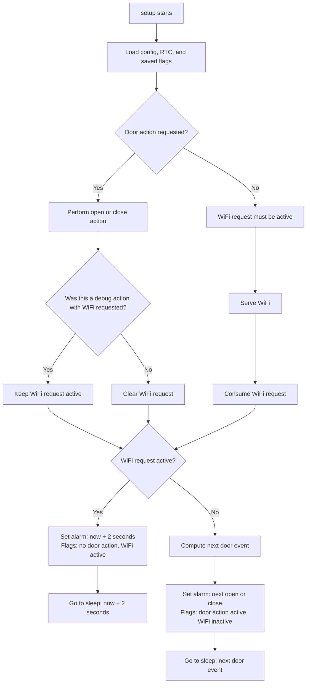
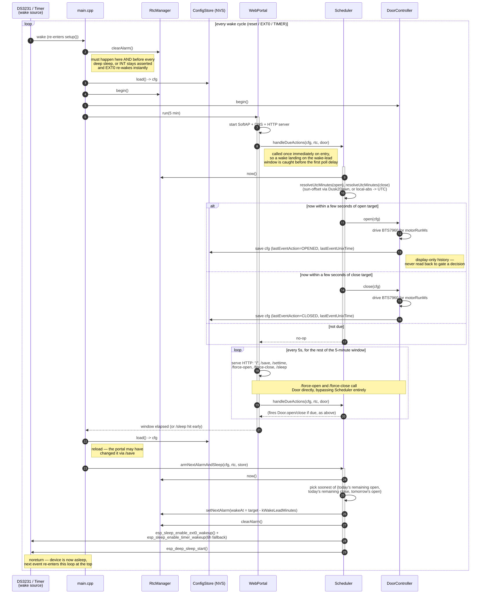

# Normal operation loop

## Single-session wake routing

The intended routing is that one `setup()` session performs either a door
action or WiFi service, never both. A debug door action may preserve the WiFi
request so that the next session serves WiFi. A normal scheduled door action
consumes it.



### Session behavior

- **Normal scheduled door action:** wake, perform the door action, clear the
  WiFi request, compute the next door event, and sleep until that event.
- **Debug door action:** wake, perform the action, preserve the WiFi request,
  and sleep until `now + 2 seconds`. The next session serves WiFi.
- **WiFi service:** wake, serve WiFi, consume the WiFi request, compute the
  next door event, and sleep until that event.

Every wake — power-on/reset, DS3231 alarm (`EXT1`), or the fallback timer
(`TIMER`) — is classified using the hardware cause and retained
two retained alarm fields: `AlarmOperateDoor` and `AlarmWifiUp`. A door
operation always runs first without WiFi. If `AlarmWifiUp` is true, the next
alarm is a separate WiFi-only wake. Otherwise the next alarm is the scheduled
door event. A WiFi-only wake runs the portal until timeout or a user request.
There is no in-RAM state carried between iterations:
everything persists through `ConfigStore` (NVS) or the DS3231 (`RtcManager`).



Diagram source: [`operation-sequence.mmd`](operation-sequence.mmd) (Mermaid). Regenerate the
SVG after editing it with:

```
npx -y @mermaid-js/mermaid-cli -i doc/operation-sequence.mmd -o doc/operation-sequence.svg -b transparent
```

## Reading notes

- **`main.cpp` is a dispatcher, not a state machine.** It traces the hardware
  wake cause plus the retained door operation and WiFi flag. Door operation
  always takes priority; WiFi is started only by a separate subsequent wake.
- **The portal owns only WiFi sessions.** A WiFi-only wake runs it until timeout
  or a user command. Open/close commands schedule a separate door operation
  wake, optionally followed by another WiFi wake.
- **No idempotency anywhere.** `DoorController::open()`/`close()` always
  drives the motor when called; `Scheduler` decides *whether* to call it
  purely from "is `now` inside the fire window" with no "already done today"
  memory. Safety against double-firing comes from the fire window being a
  few seconds wide combined with `armNextAlarmAndSleep()` waking at the target
  — not from any persisted state. Explicit web actions use the same scheduler
  entry point but do not modify the schedule trigger debounce.
- **Web open/close requests are deferred actions.** The portal closes WiFi and
  arms a one-second wake with `AlarmOperateDoor::door_open` or
  `AlarmOperateDoor::door_close` and `AlarmWifiUp=true`; the motor is never
  driven from the active WiFi request path. `/sleep` remains the schedule-sleep
  route.
