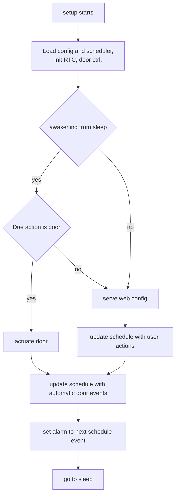

# Normal operation loop

## Single-session wake routing

The intended routing is that one `setup()` session performs either a door
action or WiFi service, never both. A debug door action may preserve the WiFi
request so that the next session serves WiFi. A normal scheduled door action
consumes it.

### Session behavior

- **Normal scheduled door action:** retain the resolved UTC trigger timestamp
  when arming the RTC. On `EXT1`, compare the current UTC timestamp with it;
  perform the action only at the target time.
  If the wake is early, skip the motor, clear the fired alarm, and re-arm the
  same target before returning to deep sleep. If the wake is more than two
  minutes late, skip the stale action and arm the next door event.
- **Debug door action:** wake, perform the action, preserve the WiFi request,
  and sleep until `now + 2 seconds`. The next session serves WiFi.
- **WiFi service:** wake, serve WiFi, consume the WiFi request, compute the
  next door event, and sleep until that event.

Every wake — power-on/reset, DS3231 alarm (`EXT1`), or the fallback timer
(`TIMER`) — is classified using the hardware cause and three retained alarm
fields: `AlarmOperateDoor`, `AlarmWifiUp`, and the UTC requested alarm
timestamp. A door operation always runs first without WiFi.
 Scheduled door operations validate the timestamp before moving; an
 `AlarmWifiUp` action is explicit and immediate, followed by a separate
 WiFi-only wake. Otherwise the next alarm is the scheduled door event. A
 WiFi-only wake runs the portal until timeout or a user request.
There is no in-RAM state carried between iterations:
everything persists through `ConfigStore` (NVS) or the DS3231 (`RtcManager`).

## Reading notes

- **`main.cpp` is a dispatcher, not a state machine.** It traces the hardware
  wake cause plus the retained door operation and WiFi flag. Door operation
  always takes priority; WiFi is started only by a separate subsequent wake.
- **The portal owns only WiFi sessions.** A WiFi-only wake runs it until timeout
  or a user command. Open/close commands schedule a separate door operation
  wake, optionally followed by another WiFi wake.
- **Scheduled movement is timestamp-gated.** `DoorController::open()`/`close()`
  always drives the motor when called. A scheduled `EXT1` wake calls it only
  when the current UTC timestamp is at or after the retained alarm timestamp. 
  An early wake re-arms that same target;
  explicit web actions bypass the scheduled check.
- **Web open/close requests are deferred actions.** The portal closes WiFi and
  arms a one-second wake with `AlarmOperateDoor::door_open` or
  `AlarmOperateDoor::door_close` and `AlarmWifiUp=true`; the motor is never
  driven from the active WiFi request path. `/sleep` remains the schedule-sleep
  route.
